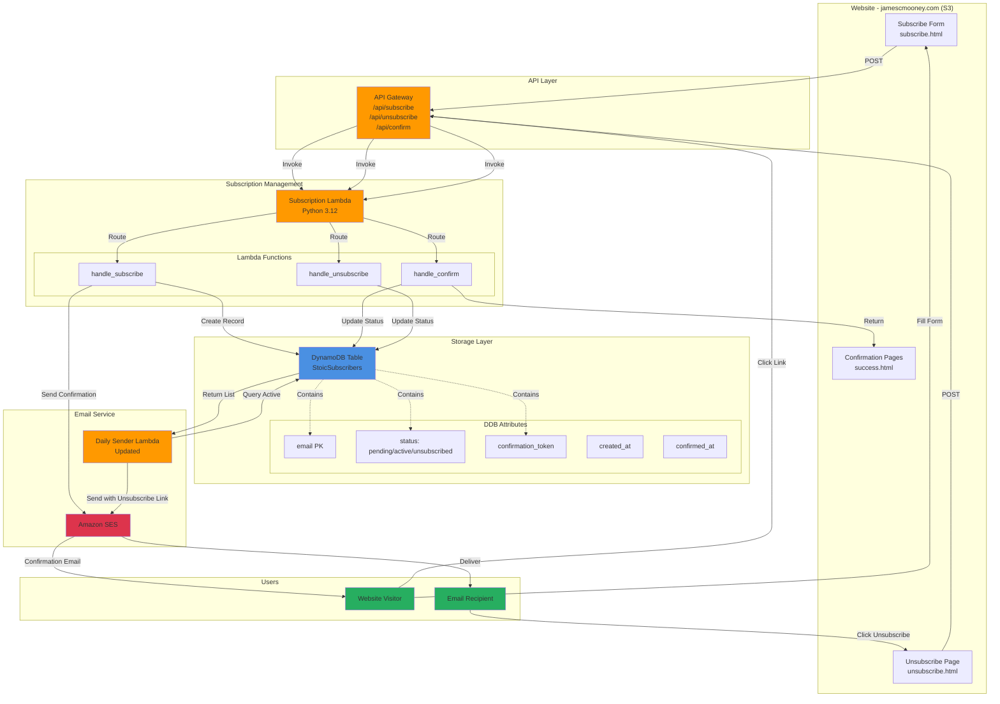
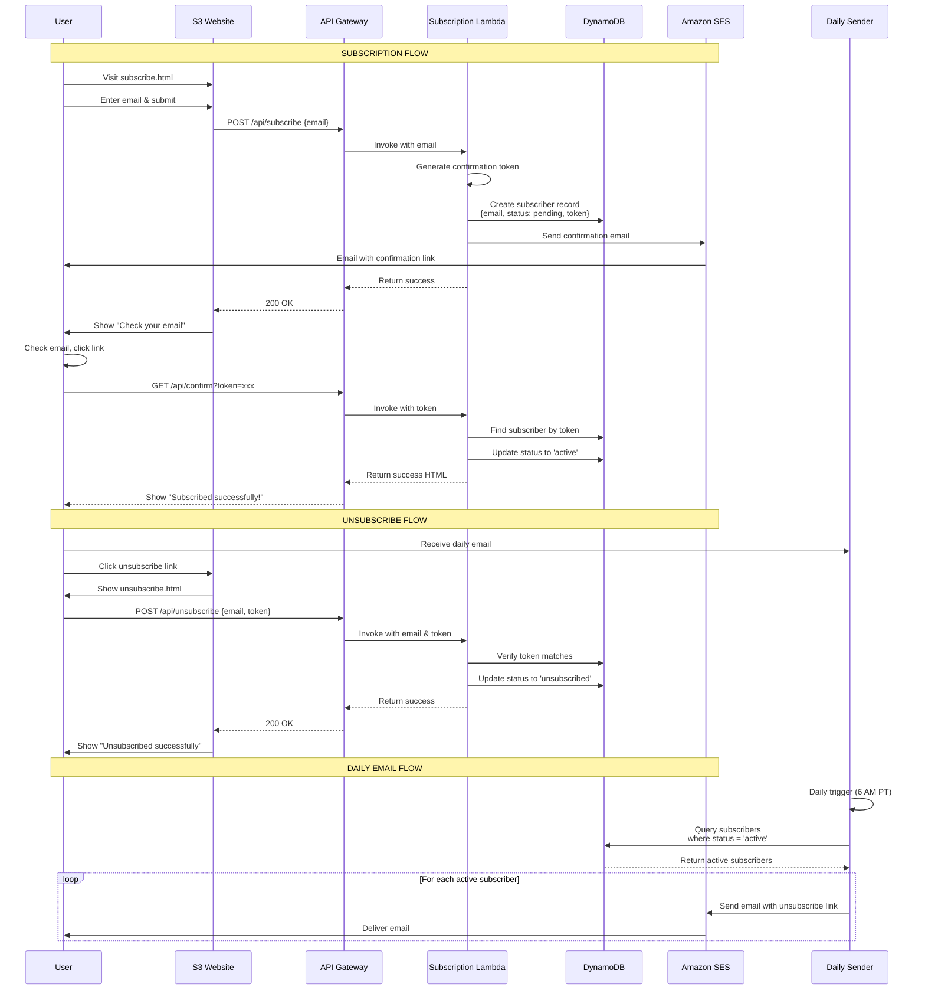

# Subscription Management Feature - Implementation Plan

## Overview

This document outlines the comprehensive plan to add subscription and unsubscription capabilities to the Daily Stoic Reflection email service. Users will be able to self-subscribe via a form on jamescmooney.com and unsubscribe via a link in every email.

## Architecture Changes

### Current Architecture
```
Static Website (S3) → jamescmooney.com
Lambda (Daily Sender) → Reads recipients.json from S3 → Sends emails via SES
```

### New Architecture
```
Static Website (S3) → jamescmooney.com
  ├── Subscribe Form → API Gateway → Subscription Lambda → DynamoDB + SES (confirmation)
  └── Unsubscribe Link → API Gateway → Subscription Lambda → DynamoDB

Lambda (Daily Sender) → Reads from DynamoDB → Sends emails via SES (with unsubscribe links)
```

## System Architecture Diagram



## Data Flow Sequence



## Components to Create

### 1. DynamoDB Table: `StoicSubscribers`

**Schema:**
```
Primary Key: email (String)
Attributes:
  - email: string (PK)
  - status: string (pending | active | unsubscribed)
  - confirmation_token: string
  - unsubscribe_token: string
  - created_at: string (ISO 8601)
  - confirmed_at: string (ISO 8601)
  - unsubscribed_at: string (ISO 8601)
  - source: string (web | manual | migration)

GSI: StatusIndex
  - PK: status
  - Used for querying all active subscribers
```

### 2. Subscription Lambda Function

**Purpose:** Handle subscribe, unsubscribe, and confirm requests

**Endpoints:**
- `POST /api/subscribe` - Create new subscription
- `GET /api/confirm` - Confirm email subscription
- `POST /api/unsubscribe` - Unsubscribe from list
- `GET /api/unsubscribe` - Render unsubscribe form

**Environment Variables:**
- `TABLE_NAME`: DynamoDB table name
- `SENDER_EMAIL`: Confirmation email sender
- `WEBSITE_URL`: Base URL for confirmation links
- `AWS_REGION`: AWS region

### 3. API Gateway

**Configuration:**
- REST API (or HTTP API for lower cost)
- CORS enabled for jamescmooney.com
- Custom domain: api.jamescmooney.com (optional)
- Endpoints:
  - `POST /api/subscribe`
  - `GET /api/confirm`
  - `POST /api/unsubscribe`
  - `GET /api/unsubscribe`

### 4. Website Forms (S3)

**Files to create:**
- `subscribe.html` - Subscription form
- `unsubscribe.html` - Unsubscribe confirmation page
- `success.html` - Generic success page
- `error.html` - Generic error page
- `css/subscription.css` - Styling for forms
- `js/subscription.js` - Form handling JavaScript

### 5. Updated Email Templates

**Changes to `email_formatter.py`:**
- Add unsubscribe link to footer
- Include unsubscribe token in link
- Update plain text template with unsubscribe instructions

### 6. Updated Daily Lambda

**Changes to `handler.py`:**
- Replace `load_recipients_from_s3()` with `load_subscribers_from_dynamodb()`
- Query DynamoDB for active subscribers
- Pass unsubscribe tokens to email formatter

## Security Considerations

### 1. Token Generation
- Use `secrets.token_urlsafe(32)` for confirmation and unsubscribe tokens
- Store hashed tokens in DynamoDB (optional for extra security)
- Tokens expire after 24 hours for confirmation

### 2. Rate Limiting
- API Gateway throttling: 10 requests/second per IP
- Lambda concurrent execution limit
- Prevent email bombing with cooldown periods

### 3. Data Privacy
- No PII beyond email address
- GDPR compliance: easy unsubscribe
- Data retention: soft delete (mark as unsubscribed)

### 4. Email Validation
- Validate email format before storing
- Send confirmation to prevent spam signups
- Implement honeypot field in form (anti-bot)

### 5. CORS Configuration
- Allow only jamescmooney.com origin
- Proper headers for API Gateway

## Migration Strategy

### Phase 1: Deploy Infrastructure (Week 1)
1. Create DynamoDB table
2. Deploy Subscription Lambda
3. Deploy API Gateway
4. Test APIs with Postman/curl

### Phase 2: Migrate Existing Subscribers (Week 1)
1. Create migration script
2. Import existing recipients.json to DynamoDB
3. Mark all as `status: active` with `source: migration`
4. Keep recipients.json as backup

### Phase 3: Deploy Website Forms (Week 1)
1. Create HTML forms
2. Test locally
3. Upload to S3
4. Test end-to-end flow

### Phase 4: Update Daily Lambda (Week 2)
1. Update handler.py to read from DynamoDB
2. Update email templates with unsubscribe links
3. Deploy updated Lambda
4. Test with small group

### Phase 5: Full Rollout (Week 2)
1. Monitor for 48 hours
2. Retire recipients.json (keep as archive)
3. Document new subscription process
4. Update README

## Cost Analysis

### Additional Monthly Costs

| Service | Usage | Unit Cost | Monthly Cost |
|---------|-------|-----------|--------------|
| **DynamoDB** | | | |
| - On-Demand Reads | 900 reads/month | $0.25/million | $0.00 |
| - On-Demand Writes | 100 writes/month | $1.25/million | $0.00 |
| - Storage | < 1 GB | $0.25/GB | $0.00 |
| **API Gateway** | | | |
| - HTTP API Requests | 100 requests/month | $1.00/million | $0.00 |
| **Subscription Lambda** | | | |
| - Invocations | 100 executions | Free tier | $0.00 |
| - Compute | 100ms average | Free tier | $0.00 |
| **SES (Confirmations)** | | | |
| - Confirmation Emails | ~10/month | $0.10/1000 | $0.00 |
| | | **Total** | **~$0.00** |

**Updated Total Service Cost: ~$0.18/month** (no increase!)

## Testing Strategy

### Unit Tests
- Test subscription Lambda handlers
- Test token generation and validation
- Test DynamoDB operations
- Test email formatting with unsubscribe links

### Integration Tests
- Test full subscription flow
- Test confirmation email delivery
- Test unsubscribe flow
- Test daily email with unsubscribe link

### Manual Testing Checklist
- [ ] Subscribe with valid email
- [ ] Receive confirmation email
- [ ] Click confirmation link
- [ ] Verify status changed to 'active'
- [ ] Receive daily email
- [ ] Click unsubscribe link in email
- [ ] Verify status changed to 'unsubscribed'
- [ ] Confirm no more daily emails received
- [ ] Test duplicate subscription
- [ ] Test invalid email format
- [ ] Test expired confirmation token
- [ ] Test invalid unsubscribe token

## API Specifications

### POST /api/subscribe

**Request:**
```json
{
  "email": "user@example.com"
}
```

**Response (Success):**
```json
{
  "success": true,
  "message": "Please check your email to confirm your subscription.",
  "email": "user@example.com"
}
```

**Response (Error):**
```json
{
  "success": false,
  "error": "Invalid email format"
}
```

### GET /api/confirm?token=xxx

**Response (Success):**
```html
<!DOCTYPE html>
<html>
<head><title>Subscription Confirmed</title></head>
<body>
  <h1>Successfully Subscribed!</h1>
  <p>You will receive your first Daily Stoic Reflection tomorrow morning at 6 AM PT.</p>
</body>
</html>
```

**Response (Error):**
```html
<!DOCTYPE html>
<html>
<head><title>Invalid Token</title></head>
<body>
  <h1>Invalid or Expired Link</h1>
  <p>Please try subscribing again.</p>
</body>
</html>
```

### POST /api/unsubscribe

**Request:**
```json
{
  "email": "user@example.com",
  "token": "unsubscribe_token_here"
}
```

**Response (Success):**
```json
{
  "success": true,
  "message": "You have been successfully unsubscribed.",
  "email": "user@example.com"
}
```

### GET /api/unsubscribe?email=xxx&token=yyy

**Response:**
```html
<!DOCTYPE html>
<html>
<head><title>Unsubscribe</title></head>
<body>
  <h1>Unsubscribe from Daily Stoic Reflections</h1>
  <form method="POST" action="/api/unsubscribe">
    <input type="hidden" name="email" value="user@example.com">
    <input type="hidden" name="token" value="token_here">
    <button type="submit">Confirm Unsubscribe</button>
  </form>
</body>
</html>
```

## File Structure

```
daily-stoic-reflection/
├── lambda/
│   ├── handler.py                    # Updated: DynamoDB integration
│   ├── email_formatter.py             # Updated: Unsubscribe links
│   ├── subscription_handler.py        # NEW: Subscription Lambda
│   ├── subscriber_manager.py          # NEW: DynamoDB operations
│   └── token_manager.py               # NEW: Token generation/validation
├── infra/
│   ├── stoic_stack.py                 # Updated: Add DynamoDB, API Gateway
│   └── subscription_stack.py          # NEW: Subscription infrastructure
├── website/
│   ├── subscribe.html                 # NEW: Subscription form
│   ├── unsubscribe.html               # NEW: Unsubscribe page
│   ├── success.html                   # NEW: Success page
│   ├── error.html                     # NEW: Error page
│   ├── css/
│   │   └── subscription.css           # NEW: Form styling
│   └── js/
│       └── subscription.js            # NEW: Form handling
├── scripts/
│   └── migrate_subscribers.py         # NEW: Migration script
├── tests/
│   ├── test_subscription_handler.py   # NEW: Subscription tests
│   └── test_subscriber_manager.py     # NEW: DynamoDB tests
└── docs/
    ├── SUBSCRIPTION_FEATURE.md        # This document
    └── SUBSCRIPTION_DEPLOYMENT.md     # NEW: Deployment guide
```

## Implementation Checklist

### Infrastructure Setup
- [ ] Create DynamoDB table schema
- [ ] Update CDK stack with DynamoDB
- [ ] Create Subscription Lambda code
- [ ] Create API Gateway configuration
- [ ] Deploy infrastructure changes
- [ ] Test APIs with curl/Postman

### Website Forms
- [ ] Create subscribe.html
- [ ] Create unsubscribe.html
- [ ] Create CSS styling
- [ ] Create JavaScript form handling
- [ ] Test forms locally
- [ ] Upload to S3 bucket
- [ ] Configure S3 bucket for website hosting (if not already)
- [ ] Test forms in browser

### Email Updates
- [ ] Update email_formatter.py with unsubscribe links
- [ ] Test email rendering with unsubscribe links
- [ ] Update plain text template
- [ ] Test HTML and plain text versions

### Lambda Updates
- [ ] Create subscriber_manager.py
- [ ] Create token_manager.py
- [ ] Update handler.py to use DynamoDB
- [ ] Deploy updated Daily Lambda
- [ ] Test with test subscriber

### Migration
- [ ] Create migration script
- [ ] Test migration with sample data
- [ ] Migrate existing recipients
- [ ] Verify all migrated correctly
- [ ] Keep recipients.json as backup

### Testing
- [ ] Write unit tests
- [ ] Write integration tests
- [ ] Perform manual testing
- [ ] Test all error scenarios
- [ ] Load testing (optional)

### Documentation
- [ ] Update README.md
- [ ] Create SUBSCRIPTION_DEPLOYMENT.md
- [ ] Update ARCHITECTURE.md
- [ ] Document API endpoints
- [ ] Create migration guide

### Deployment
- [ ] Deploy to staging (if available)
- [ ] Smoke test all features
- [ ] Deploy to production
- [ ] Monitor for 48 hours
- [ ] Document any issues

## Rollback Plan

If issues arise after deployment:

1. **Immediate Rollback:**
   - Revert Lambda handler to read from recipients.json
   - Keep new infrastructure running but unused
   - No data loss (DynamoDB retains data)

2. **API Issues:**
   - Disable API Gateway endpoints
   - Remove subscription forms from website
   - Daily emails continue unaffected

3. **Data Issues:**
   - DynamoDB backups available (point-in-time recovery)
   - Original recipients.json retained as backup
   - Can restore from either source

## Future Enhancements

### Phase 2 Features (Optional)
1. **Admin Dashboard:**
   - View subscriber count
   - Export subscriber list
   - Manual add/remove subscribers
   - View subscription analytics

2. **Preference Management:**
   - Frequency selection (daily, weekly, monthly)
   - Theme preferences
   - Pause subscription (vacation mode)

3. **Double Opt-In Compliance:**
   - Already implemented in Phase 1

4. **Analytics:**
   - Track subscription sources
   - Monitor unsubscribe rates
   - Email open rates (via tracking pixels)

5. **Email Verification:**
   - Check email deliverability before accepting
   - Prevent disposable email addresses

## Support and Maintenance

### Monitoring
- CloudWatch alarms for Lambda errors
- DynamoDB metrics (throttling, errors)
- API Gateway error rates
- SES bounce/complaint rates

### Regular Maintenance
- Review subscriber list monthly
- Clean up unsubscribed records (after 30 days)
- Monitor costs
- Update dependencies

### Support Process
- Monitor bounced emails
- Handle subscription issues
- Respond to unsubscribe requests manually if needed

## Success Metrics

### Key Performance Indicators
- **Subscription Rate:** Target 5-10 new subscribers/month
- **Confirmation Rate:** Target 80%+ confirm their email
- **Unsubscribe Rate:** Target < 1% per month
- **Email Delivery Rate:** Target 99%+
- **API Uptime:** Target 99.9%+

### Analytics to Track
- Total active subscribers
- Subscription growth over time
- Confirmation rate by source
- Unsubscribe reasons (if collected)
- Email engagement metrics

---

**Document Version:** 1.0
**Created:** 2025-10-25
**Author:** Daily Stoic Reflection Team
**Status:** Ready for Implementation
